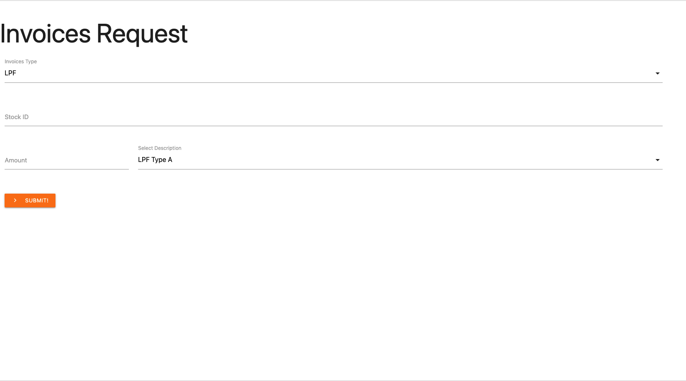

# gas-invoices-tool
A simple Google Apps Script WebApp to submit entries to sheet and relies on a components library

## Table of Contents

* [Technologies](#technologies)
* [Features](#features)
* [Questions](#questions)

## Technologies 

* Google Apps Script
* JavaScript ES6
* HTML5
* CSS3

## Features

* Library that generates HTML modules and components that later is used to create the page elements
* Accepts different types of invoices with different conditions
* Form can add new rows and remove rows dynamically for one type of invoices
* Submits form response to the Google Apps Script backend which then writes into Google sheets

## Questions 

If you have any more questions, please contact me here:

Github Username: [mohamedallam13](https://mohamedallam13.github.io/react-professional-portfolio/)

Email: [mohamedallam.tu@gmail.com](mailto:mohamedallam.tu@gmail.com)

